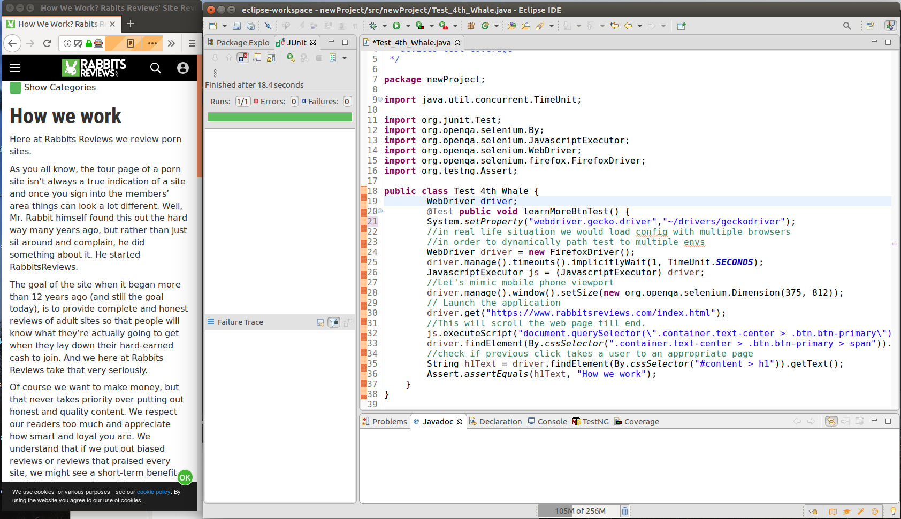

# Test for 4th whale

### The test requirements are following:

- Acceptance criteria verification
- Written test case
- Automation: Using the framework of your choice

#### Acceptance criteria verification:

Acceptance criteria verification is located in `Acceptance_criteria_verification.docx`  file. 

#### Written test case:

 Written test case is located in `Functional_Test_Case.docx`  file. 
 
#### Automation: Using the framework of your choise:

For automation test **Selenium Web-driver** was being used.
Please see the following screenshot:

The test script is located in `automatedTest.java`